<!--
  ══════════════════════════════════════════════════════════════════════════
   JAYANT AWASTHI — ANIMATED GITHUB PROFILE README
   Built with local SVG assets (banner, stats, langs, trophies) + SMIL/CSS
   animation, a nightly GitHub Actions contribution-snake workflow, and
   live badge/stat services for anything that has to reflect real-time data.

   REPO LAYOUT THIS FILE EXPECTS (all relative paths below assume this):
     ├── README.md                      <- this file
     ├── banner.svg                     <- dark animated banner (uploaded)
     ├── banner-light.svg               <- light animated banner (uploaded)
     ├── stats.svg                      <- local animated stat card (uploaded)
     ├── langs.svg                      <- local animated language card (uploaded)
     ├── trophies.svg                   <- local animated trophy case (uploaded)
     ├── avatar.jpeg                    <- illustrated avatar (uploaded)
     └── .github/workflows/github-snake.yml   <- nightly snake generator (uploaded)

   Push all of the above to the special `jayant-01-aws/jayant-01-aws` repo
   (a repo whose name matches your username) and GitHub will render this
   as your profile page at https://github.com/jayant-01-aws
  ══════════════════════════════════════════════════════════════════════════
-->

<div align="center">

<!-- ═══════════════════════════ BANNER (local, animated) ═══════════════════════════ -->
<picture>
  <source media="(prefers-color-scheme: dark)" srcset="banner.svg?v=1">
  <source media="(prefers-color-scheme: light)" srcset="banner-light.svg?v=1">
  
</picture>

<!-- Typing tagline — live service, always current, no local file needed -->
<h3>
  
</h3>

<br>

<!-- ═══════════════════════════ AVATAR / ID CARD (local image) ═══════════════════════════ -->


<br><br>

<sub>📍 Bhopal, Madhya Pradesh, India &nbsp;·&nbsp; 🎓 MCA @ LNCT (RGPV) 2025–2027 &nbsp;·&nbsp; 💻 Java + DSA Trainee @ Sheryians Coding School</sub>

<br><br>

<!-- ═══════════════════════════ SOCIAL / CONNECT BADGES ═══════════════════════════ -->
<a href="https://www.linkedin.com/in/jayant-awasthi-544745372/" target="_blank">
  
</a>
<a href="mailto:jayantawasthi18@gmail.com" target="_blank">
  
</a>
<a href="https://twitter.com/krishna05703435" target="_blank">
  
</a>
<a href="https://leetcode.com/u/be_a_Jayant_786/" target="_blank">
  
</a>
<a href="https://www.instagram.com/_.jayant_.aws/" target="_blank">
  
</a>
<a href="https://jayant-01-aws.github.io/Stellar-Portfolio" target="_blank">
  
</a>

<br><br>

<!-- ═══════════════════════════ PROFILE VIEWS / STATUS (live services) ═══════════════════════════ -->


</div>

<br>

---

## 📑 Table of Contents

<div align="center">

[About Me](#-about-me) &nbsp;•&nbsp;
[Education](#-education) &nbsp;•&nbsp;
[Tech Stack](#%EF%B8%8F-tech-stack) &nbsp;•&nbsp;
[Local Stat Cards](#-local-stat-cards) &nbsp;•&nbsp;
[Trophy Case](#-trophy-case) &nbsp;•&nbsp;
[Professional Experience](#-professional-experience) &nbsp;•&nbsp;
[Featured Projects](#%EF%B8%8F-featured-projects) &nbsp;•&nbsp;
[Courses & Training](#-courses--training) &nbsp;•&nbsp;
[Industry Job Simulations](#-industry-job-simulations) &nbsp;•&nbsp;
[Certificates](#-certificates) &nbsp;•&nbsp;
[Academic Internships](#-academic-internships) &nbsp;•&nbsp;
[Achievements & Activities](#-achievements--activities) &nbsp;•&nbsp;
[Tools](#%EF%B8%8F-tools) &nbsp;•&nbsp;
[Contribution Activity](#-contribution-activity) &nbsp;•&nbsp;
[Streak Stats](#-streak-stats) &nbsp;•&nbsp;
[Contribution Snake](#-contribution-snake) &nbsp;•&nbsp;
[This Week I'm Coding](#%EF%B8%8F-this-week-im-coding) &nbsp;•&nbsp;
[Support](#-support-my-work) &nbsp;•&nbsp;
[Connect](#-lets-connect)

</div>

<br>

---

## 👋 About Me

<table>
<tr>
<td width="58%" valign="top">

```txt
const jayant = {
  name         : "Jayant Awasthi",
  role         : "Software Engineer",
  pronouns     : "he / him",
  location     : "Bhopal, Madhya Pradesh, India",
  currentlyOn  : "MCA @ LNCT, Bhopal (RGPV) — 2025-2027",
  training     : "Java + DSA @ Sheryians Coding School (8-month, offline)",
  focus        : ["Java", "DSA", "Full-Stack Development", "AI / OCR"],
  loop         : "Learning → Building → Improving → Repeat",
  askMeAbout   : ["Spring Boot", "React", "Django", "OpenCV", "Computer Vision"],
  funFact      : "Animates a GitHub profile with hand-crafted local SVGs ✨",
};
```

- 🎓 MCA student at **Lakshmi Narain College of Technology (LNCT), Bhopal**, under **RGPV**
- 🧠 Deep focus on **Java, Data Structures & Algorithms**, and **Full-Stack Development**
- 🤖 Building **AI / OCR** and computer-vision powered tools — hybrid AI engines, vision pipelines, semantic layout reconstruction
- 🌱 Currently in an intensive 8-month offline **Java + DSA** training program at **Sheryians Coding School**
- 💼 Hands-on internship experience spanning web development, PHP backend systems, and Java full-stack engineering
- 🧩 Comfortable moving between frontend polish (React, Three.js, GSAP) and backend rigor (Spring Boot, Django, SQL schema design)
- 💬 Ask me about Spring Boot, React, Django, OpenCV, or anything OCR/vision related
- ⚡ Fun fact: this entire profile is animated using hand-crafted, locally-hosted SVGs — no third-party render dependency, no broken-image icons

</td>
<td width="42%" valign="top" align="center">


<br><br>

> "Keep a great zest in implementation of each step of a project.
> Always willing to innovate the things that can improve on what
> already exists."

</td>
</tr>
</table>

<br>

---

## 🎓 Education

<table>
<tr>
<td valign="top" width="50%">

### 🏫 Master of Computer Application (MCA)
**University:** RGPV, Bhopal, M.P.
**College:** Lakshmi Narain College of Technology (LNCT), Bhopal
📅 **2025 – 2027**
📌 *In progress*

### 🏫 Bachelor of Computer Application (BCA)
**University:** Barkatullah, Bhopal, M.P.
**College:** Bhopal School of Social Sciences (BSSS), Bhopal
📅 **2021 – 2024**
🎯 **Percentage: 80.30%**

</td>
<td valign="top" width="50%">

### 🏫 Intermediate (12th Grade)
**School:** Vikram Higher Secondary School (VHSS), Bhopal
📅 **2020 – 2021**
🎯 **Percentage: 83%**

### 🏫 High School (10th Grade)
**School:** Vikram Higher Secondary School (VHSS), Bhopal
📅 **2019 – 2020**
🎯 **Percentage: 80%**

</td>
</tr>
</table>

<div align="center">

```text
2019 ──● High School (80%)
2020 ──● Intermediate (83%)
2021 ──● BCA begins, BSSS Bhopal
2024 ──● BCA completed (80.30%)   ●── Web Dev Intern, MurphTech
2024 ──● Backend Intern, Express-E-Connect
2025 ──● MCA begins, LNCT Bhopal (RGPV)   ●── Java Full Stack Virtual Intern, EduSkills
2026 ──● Java + DSA training, Sheryians Coding School (ongoing)
2027 ──● MCA completion (expected)
```

</div>

<br>

---

## 🛠️ Tech Stack

<div align="center">

**Languages**


**Frameworks & Libraries**


**Databases, Tools & Platforms**


**IDEs, Editors & Collaboration**


</div>

<br>

### 📊 Self-Rated Proficiency

<div align="center">

```text
Java                 ████████████████░░░░   80%
Data Structures/Algo ███████████████░░░░░   75%
PHP + MySQL          ██████████████████░░   90%
Python               ██████████████░░░░░░   70%
React / Frontend     █████████████████░░░   85%
Spring Boot / MVC    ███████████░░░░░░░░░   55%
Django               █████████████░░░░░░░   65%
OpenCV / Computer V  ██████████████░░░░░░   70%
C / C++              ████████████░░░░░░░░   60%
AngularJS / Haskell  ██████░░░░░░░░░░░░░░   30%  (learning)
```

<sub>Self-assessed, updated periodically as skills grow.</sub>

</div>

<br>

---

## 🧬 Local Stat Cards

<sub>Rendered locally as pure animated SVG — no third-party API, no rate limits, never a broken-image icon.</sub>

<div align="center">


</div>

<br>

---

## 🏆 Trophy Case

<div align="center">


</div>

<br>

---

## 💼 Professional Experience

### 🔹 Java Full Stack Developer (Virtual Intern)
**EduSkills Academy** &nbsp;|&nbsp; Oct 2025 – Dec 2025 *(3 Months)*

| | |
|---|---|
| **Focus** | End-to-end Java full-stack application development |
| **Highlights** | Agile methodology, scalable DB schema design, API integration |

- Executing a 6-month Java Full Stack program, focusing on end-to-end application development
- Developing web applications using Java backend technologies and modern front-end frameworks
- Applying industry-standard software practices in a virtual environment to meet project milestones
- Built and optimized scalable database structures and integrated them with functional user interfaces
- Architecting and optimizing scalable database schemas using SQL to support high-concurrency data storage and retrieval
- Applying industry-standard Agile methodologies and software development best practices within a virtual collaborative environment to meet project deadlines
- Implementing robust API integrations and server-side logic to enhance the functionality and performance of web-based solutions

<br>

### 🔹 Back-end Executive (Intern)
**Express-E-Connect Pvt Ltd** &nbsp;|&nbsp; May 2024 – Oct 2024 *(6 Months)*

| | |
|---|---|
| **Focus** | PHP/MySQL backend for a restaurant reservation system |
| **Highlights** | Custom admin panel, CRUD architecture, PR-department coordination |

- Developed a dynamic reservation system using **PHP** and **MySQL** to automate table bookings and reduce manual overhead
- Engineered a custom **Admin Panel** for real-time management of approvals, cancellations, and table availability
- Designed a secure database architecture to handle CRUD operations and ensure data consistency during peak hours
- Managed backend operations within the Public Relations department, ensuring efficient data handling and client information management
- Collaborated under the Project Head to maintain accurate records and facilitate smooth communication between the technical and PR teams

<br>

### 🔹 Web Developer Intern
**MurphTech Software Solutions** &nbsp;|&nbsp; Nov 2023 – April 2024 *(6 Months)*

| | |
|---|---|
| **Focus** | Dynamic web application development |
| **Highlights** | Full SDLC exposure, cross-browser optimization, direct founder collaboration |

- Developed dynamic web applications within the Development department to improve site functionality and interactivity
- Collaborated directly under the Founder/CEO to translate business requirements into functional code
- Contributed to the full SDLC, including debugging and optimizing web components for high performance
- Optimized front-end components for maximum speed and scalability, ensuring 100% compatibility across diverse mobile and desktop browsers
- Maintained clean, documented code and utilized version control systems to ensure project continuity and team collaboration

<br>

---

## 🗂️ Featured Projects

### 🌐 Interactive 3D Developer Portfolio

**Stack:** `React.js` `Three.js` `React Three Fiber (R3F)` `GSAP` `Framer Motion` `Tailwind CSS` `Vite`

```text
┌──────────────────────────────────────────────┐
│   Browser                                     │
│   ┌──────────────┐   ┌─────────────────────┐  │
│   │  R3F Canvas  │──▶│ Custom 3D Models     │  │
│   │  (WebGL)     │   │ (Spline exports)     │  │
│   └──────┬───────┘   └─────────────────────┘  │
│          │                                    │
│   ┌──────▼───────┐   ┌─────────────────────┐  │
│   │ GSAP Scroll  │──▶│ Elastic Cursor      │  │
│   │ Triggers     │   │ Physics Engine      │  │
│   └──────────────┘   └─────────────────────┘  │
└──────────────────────────────────────────────┘
```

- **Key Achievement:** Engineered a high-performance immersive 3D environment featuring real-time WebGL rendering
- **Core Features:** Integrated custom 3D models (Spline), scroll-triggered animations (GSAP), and an elastic cursor physics engine
- **Performance:** Optimized 3D asset delivery and lazy loading to ensure a seamless **60 FPS** experience across mobile and desktop devices
- **Architecture:** Built a modular component system to manage complex 3D scenes, keeping the codebase scalable and easy to maintain for future feature updates
- **GPU Acceleration:** Leveraged WebGL and GPU acceleration to handle high-fidelity animations without compromising the main thread's processing speed
- 🔗 **Live:** [jayant-01-aws.github.io/Stellar-Portfolio](https://jayant-01-aws.github.io/Stellar-Portfolio)

<br>

### 🍽️ Restaurant Table Booking System

**Stack:** `PHP` `MySQL` `HTML` `CSS` `JavaScript`

```text
Customer ──▶ Booking Form ──▶ PHP Controller ──▶ MySQL (reservations)
                                     │
                                     ▼
                            Admin Panel (live)
                     approvals · cancellations · availability
```

- Developed a dynamic reservation system using PHP and MySQL to automate table bookings and reduce manual overhead
- Engineered a custom Admin Panel for real-time management of approvals, cancellations, and table availability
- Designed a secure database architecture to handle CRUD operations and ensure data consistency during peak hours
- Managed backend operations within the Public Relations department at Express-E-Connect Pvt Ltd
- 🔗 - **Live:** [table-reservation.xo.je](https://table-reservation.xo.je)

<br>


### 🤖 AI-Powered OCR & Handwriting Digitization Platform

**Stack:** `Python (Django)` `OpenCV` `Google Gemini 1.5 Flash API` `PyTesseract` `NumPy` `Pillow (PIL)` `SQLite/PostgreSQL`

```text
Handwritten Doc
      │
      ▼
┌───────────────────┐     ┌──────────────────────┐
│ Vision Pipeline    │────▶│ Hybrid AI Engine      │
│ Adaptive CLAHE +   │     │ Gemini 1.5 Flash  +   │
│ Bilateral Filtering│     │ Tesseract OCR         │
└───────────────────┘     └──────────┬───────────┘
                                      ▼
                     ┌────────────────────────────┐
                     │ Heuristic Ranking Algorithm │
                     │ (best PSM / lexical density)│
                     └──────────────┬─────────────┘
                                    ▼
                     ┌────────────────────────────┐
                     │ Semantic Layout Analysis    │
                     │ (LLM prompt engineering)    │
                     │ headers · tables · body     │
                     └──────────────┬─────────────┘
                                    ▼
                       Django Middleware Logging
                     (latency + availability monitor)
```

- **Hybrid AI Engine:** Orchestrated **Google Gemini 1.5 Flash** and **Tesseract OCR** to extract high-fidelity text from unstructured handwritten documents
- **Vision Pipeline:** Engineered in **OpenCV** using **Adaptive CLAHE** and **Bilateral Filtering** to eliminate environmental noise and normalize document lighting
- **Heuristic Ranking Algorithm:** Evaluates multiple **Page Segmentation Modes (PSM)** and automatically selects the output with the highest lexical density
- **Semantic Layout Analysis:** Uses LLM prompt engineering to programmatically reconstruct hierarchies like nested headers, tables, and body text
- **Robust Logging Framework:** Built with **Django Middleware** to monitor pipeline latency and ensure high system availability during peak workloads
- 🔗 **Live:** [handwriting-digitizer.onrender.com](https://handwriting-digitizer.onrender.com)

<div align="center">
<sub>📌 Pin your top repositories on your GitHub profile for a live, auto-updating version of this section.</sub>
</div>

<br>

---

## 📚 Courses & Training

<table>
<tr><th align="left">Course</th><th align="left">Provider</th><th align="left">Details</th></tr>
<tr>
<td valign="top"><b>Java + Data Structures & Algorithms (DSA)</b><br><sub>Feb 2026 – Present</sub></td>
<td valign="top">Sheryians Coding School</td>
<td valign="top">Rigorous 8-month offline professional training program focused on advanced problem-solving and software development. Building deep mastery of Java and DSA to optimize code efficiency and performance, while practicing complex algorithmic challenges to strengthen logical reasoning and computational thinking — all in preparation for high-level technical roles in software engineering.</td>
</tr>
<tr>
<td valign="top"><b>Front-End Web Development Training</b></td>
<td valign="top">Reliance Foundation & NSDC Academy</td>
<td valign="top">240-hour comprehensive training covering HTML5, CSS3 (Flexbox/Grid), JavaScript (ES6), responsive web design, and troubleshooting. Mastered a 5-module curriculum including semantic HTML structuring and OOP-style JavaScript logic. Verified Industry Credential earned through Skill India Digital Hub (Completed Feb 27, 2026).</td>
</tr>
<tr>
<td valign="top"><b>Web Design & Development</b></td>
<td valign="top">NSDC | Skill India Digital Hub</td>
<td valign="top">Verified online skilling course focused on core principles of modern web design and development, with insight into industry-standard practices for building functional, aesthetically driven web architectures. Certificate of Participation earned February 27, 2026.</td>
</tr>
<tr>
<td valign="top"><b>Cybersecurity Foundation</b></td>
<td valign="top">Tech Mahindra Foundation | NSDC</td>
<td valign="top">10-hour specialized course covering digital security protocols and best practices to protect data and systems, and modern cyber threat awareness. Verified credential completed Feb 27, 2026.</td>
</tr>
<tr>
<td valign="top"><b>Fundamentals of Artificial Intelligence (AI) for Retail</b></td>
<td valign="top">Retailers Association's Skill Council of India (RASCI)</td>
<td valign="top">30-hour micro-credential covering Predictive Analytics, Chatbots, and Computer Vision, with a focus on how AI-driven automation and data analytics improve operational efficiency and customer engagement in the retail sector.</td>
</tr>
</table>

<br>

---

## 🏢 Industry Job Simulations

<table>
<tr><th align="left">Simulation</th><th align="left">Provider</th><th align="left">Key Skills</th></tr>
<tr><td><b>Data Visualisation: Empowering Business with Effective Insights</b></td><td>Tata Group (Forage)</td><td>Data Analysis, Data Cleaning, Dashboard Development, Data Storytelling, Stakeholder Communication</td></tr>
<tr><td><b>Solutions Architecture Job Simulation</b></td><td>AWS (Forage)</td><td>Cloud Infrastructure Design, System Architecture, Cloud Cost Management, Technical Communication</td></tr>
<tr><td><b>Global Banking & Markets Job Simulation</b></td><td>HSBC (Forage)</td><td>M&A, Debt Capital Markets, Credit Analysis, Volatility Analysis, Risk-Adjusted Returns</td></tr>
<tr><td><b>Technology Job Simulation</b></td><td>Deloitte (Forage)</td><td>Data Analysis, Data Modeling, Computer Networking, Web Security, Log Analysis</td></tr>
<tr><td><b>Cyber Job Simulation</b></td><td>Deloitte (Forage)</td><td>Cybersecurity Protocols, Log Analysis, Secure Software Development</td></tr>
</table>

<br>

---

## 🎖️ Certificates

- 🎧 **MS Teams Voice Engineer (MS-720)** — Designing, configuring, and managing enterprise phone solutions within the Microsoft 365 ecosystem
- 🐘 **Learn PHP for Beginners** *(Udemy)* — Server-side scripting, web logic, and database integration fundamentals
- 🤖 **Power of Artificial Intelligence** *(Udemy)* — AI integration strategies and productivity tools across 12 specialized lectures
- 🟨 **JavaScript Programming** *(Udemy)* — DOM manipulation, logical development, and dynamic web elements
- 🐍 **The Python Programming Bootcamp** — Python syntax, data structures, and OOP concepts
- ☕ **The Java Learning Guide** *(Udemy)* — 9-hour curriculum translating theoretical core Java into functional code
- ⚙️ **Certification in C & C++** *(MCU – Makhanlal Chaturvedi University)* — Foundational programming logic and syntactic understanding

<br>

---

## 🧪 Academic Internships

### Introduction to Modern AI
**Cisco Networking Academy** &nbsp;|&nbsp; May 4–10, 2026
- **AI & NLP Foundations:** Mastered core AI/ML concepts and evaluated the nuances and limitations of machine translation
- **Computer Vision:** Applied Object Detection and Image Segmentation to classify objects and manipulate image backgrounds
- **Prompt Engineering & LLMs:** Optimized Large Language Models for summarization and idea generation using precise prompt workflows
- **Advanced Workflows:** Leveraged multimodal prompting, web scraping, and multi-chatbot collaboration to achieve complex goals

### Apply AI: Analyze Customer Reviews
**Cisco Networking Academy** &nbsp;|&nbsp; May 4–10, 2026
- **Tool Selection:** Evaluated business tasks to select optimal AI and non-AI tools like LLMs, spreadsheets, and text editors
- **Data Processing:** Cleaned and formatted tabular datasets for seamless transfer between chatbots and spreadsheet environments
- **AI-Assisted Engineering:** Prompted chatbots to write and execute code and to co-author complex Excel formulas
- **Human-in-the-Loop Validation:** Integrated checkpoints to ensure data accuracy and drive final decisions

### Data Analytics & AI Virtual Experience
**Cisco Networking Academy** &nbsp;|&nbsp; May 4–11, 2026
- **Data Transformation:** Cleaned, manipulated, and transformed diverse datasets using basic statistical and data preparation techniques with **Excel, SQL, and Tableau**
- **Portfolio Development:** Built, evaluated, and shared a comprehensive project portfolio showcasing data insights
- **AI-Assisted Engineering:** Prompted chatbots to write and execute code, co-author complex Excel formulas, and format tabular datasets

<br>

---

## 🏆 Achievements & Activities

- 🥇 **National E-Quiz on Statistics Day 2022** — Cleared the National E-Quiz organized by the Science Club, Department of Science (BSSS College) with an outstanding **90% score**, demonstrating strong proficiency in statistical concepts and logical reasoning
- 🌐 **UNXT Graduate** — SGBS Unnati Foundation (Govt. Divisional ITI, Bhopal), a 165-hour intensive Soft Skill Development Program (Feb 17 – Mar 29, 2025) covering Spoken English, Employability Skills, Life Skills, and corporate value systems
- 🤝 **TechnoCambiar** — Student-Faculty Exchange Program; participated in a 15-day academic exchange (Dec 8–23, 2021) with St. Thomas College (Bhilai) and St. Paul Institute of Professional Studies (Indore) to discuss advancements in Mathematics and Computer Science
- 📖 **"Avengers Assemble" — IGNIS Literary Society** — Represented as a student participant in a collaborative event organized by The Bhopal School of Social Sciences (BSSS), developing communication and teamwork abilities

<br>

---

## 🧰 Tools

| Category | Tools |
|---|---|
| **IDEs & Editors** | IntelliJ IDEA (Java/DSA) · PyCharm (Python) · VS Code (Web Dev & PHP) |
| **Web Tools** | Browser DevTools (debugging & inspecting UI/UX) |
| **Collaboration** | MS Teams (enterprise communication) |
| **Productivity** | Microsoft Office |

<br>

---

## 📈 Contribution Activity

<div align="center">


</div>
## 🐍 My Contribution Snake

<p align="center">
  
</p>
<!-- 📈 Contribution Activity Graph -->
<!-- 🐍 Contribution Snake -->
<!-- <p align="center">
  
</p>

<br/><br/>
<br> -->

---

## 🔥 Streak Stats

<div align="center">


</div>

<br>

---

## 🐍 Contribution Snake

<sub>Refreshed nightly by <code>.github/workflows/github-snake.yml</code> and published to the <code>output</code> branch.</sub>

<div align="center">

<picture>
  <source media="(prefers-color-scheme: dark)" srcset="https://raw.githubusercontent.com/jayant-01-aws/jayant-01-aws/output/github-contribution-grid-snake.svg?v=1">
  <source media="(prefers-color-scheme: light)" srcset="https://raw.githubusercontent.com/jayant-01-aws/jayant-01-aws/output/github-contribution-grid-snake.svg?v=1">
  
</picture>

</div>

<details>
<summary>⚙️ How the snake workflow works (click to expand)</summary>

<br>

The animation is generated by [`Platane/snk`](https://github.com/Platane/snk) on a nightly cron schedule, then committed to the `output` branch so the raw SVG can be embedded above.

```yaml
name: Generate GitHub Contribution Snake

on:
  schedule:
    - cron: "0 0 * * *"
  workflow_dispatch:

permissions:
  contents: write

jobs:
  generate:
    runs-on: ubuntu-latest

    steps:
      - name: Generate contribution snake
        uses: Platane/snk@v3
        with:
          github_user_name: ${{ github.repository_owner }}
          outputs: |
            output/github-contribution-grid-snake.svg?palette=github-dark&color_snake=%23ff4fae&color_dots=%231b1024,%23351a40,%236d2a68,%23b94d9c,%23ff8bd2

      - name: Push snake animation to output branch
        uses: crazy-max/ghaction-github-pages@v4
        with:
          build_dir: output
        env:
          GITHUB_TOKEN: ${{ secrets.GITHUB_TOKEN }}
          BUILD_DIR: output
```

This file lives at `.github/workflows/github-snake.yml` in this repo. It runs automatically every day at midnight UTC (`0 0 * * *`) and can also be triggered manually via `workflow_dispatch`. No secrets need to be configured beyond the default `GITHUB_TOKEN`, since `permissions: contents: write` is already granted at the job level.

</details>

<br>

---

## ⏱️ This Week I'm Coding

<div align="center">

```text
Java         ████████████░░░░░░░░   32.4 %
JavaScript   ██████████░░░░░░░░░░   25.1 %
PHP          ███████░░░░░░░░░░░░░   18.0 %
Python       ██████░░░░░░░░░░░░░░   15.2 %
C/C++/C#/SQL ████░░░░░░░░░░░░░░░░   10.0 %
```

<sub>Numbers in local stat cards are static snapshots — bump them by hand as your stats grow, or wire up WakaTime for a live version.</sub>

</div>

<br>

---

## 🗺️ Roadmap / Currently Learning

<div align="center">

```text
┌─────────────────────────────────────────────────────────────────┐
│  NOW                                                             │
│   ▸ Java + DSA — Sheryians Coding School (8-month offline track) │
│   ▸ Sharpening system design & cloud fundamentals                │
│                                                                   │
│  NEXT                                                            │
│   ▸ Deepen Spring Boot / Spring MVC production patterns          │
│   ▸ Ship a v2 of the AI-Powered OCR platform with a public demo  │
│   ▸ Contribute to an open-source Java or Python project          │
│                                                                   │
│  LATER                                                           │
│   ▸ System design interviews prep                                │
│   ▸ Explore distributed systems & cloud-native architecture      │
└─────────────────────────────────────────────────────────────────┘
```

</div>

<br>

- [x] Complete BCA (Bhopal School of Social Sciences) — 80.30%
- [x] Web Developer Internship — MurphTech Software Solutions
- [x] Back-end Executive Internship — Express-E-Connect Pvt Ltd
- [x] Java Full Stack Virtual Internship — EduSkills Academy
- [x] Front-End Web Development Training (240 hrs) — Reliance Foundation & NSDC
- [x] Cybersecurity Foundation — Tech Mahindra Foundation
- [x] AI for Retail micro-credential — RASCI
- [x] Cisco Networking Academy — 3 virtual experience tracks (Modern AI, Applied AI, Data Analytics)
- [x] 5 Forage job simulations — Tata, AWS, HSBC, Deloitte (x2)
- [ ] Complete Java + DSA program — Sheryians Coding School *(in progress, Feb 2026 – ~Oct 2026)*
- [ ] Complete MCA — LNCT Bhopal, RGPV *(2025 – 2027)*
- [ ] Land a Software Engineer / SDE role or high-quality internship

<br>

---

## ❓ FAQ

<details>
<summary><b>What are you currently focused on?</b></summary>
<br>
Right now my two biggest commitments are my MCA at LNCT Bhopal (RGPV) and an 8-month offline Java + DSA training program at Sheryians Coding School. Outside of that, I'm building full-stack and AI/OCR side projects to keep applying what I learn.
</details>

<details>
<summary><b>What kind of roles or projects are you looking for?</b></summary>
<br>
I'm interested in Software Engineer and Full-Stack Developer roles, particularly ones involving Java backend systems, Spring Boot, or Python/Django services — and I especially enjoy projects that blend backend engineering with AI/computer-vision components.
</details>

<details>
<summary><b>Which of your projects are you most proud of?</b></summary>
<br>
The AI-Powered OCR & Handwriting Digitization Platform — it combines a custom OpenCV vision pipeline, a hybrid AI engine (Gemini 1.5 Flash + Tesseract), and a heuristic ranking algorithm to reconstruct document structure automatically. It's the project that pushed me hardest technically.
</details>

<details>
<summary><b>How is this README built?</b></summary>
<br>
The banner, avatar, stat card, language card, and trophy case are all locally hosted SVG/image files committed directly to this repository — no third-party rendering API required for them. The contribution graph and streak stats use live badge services since those need to reflect real-time GitHub data. The contribution snake is generated nightly by a GitHub Actions workflow (see the Contribution Snake section above).
</details>

<details>
<summary><b>Can I use this README as a template?</b></summary>
<br>
Sure — swap out the personal details, replace the local SVGs with your own, update the badge usernames, and point the workflow at your own repository. See the setup checklist at the bottom of this file for the full list of things to update.
</details>

<br>

---

## 🌐 Languages I Speak

<div align="center">

| Language | Proficiency |
|---|---|
| English | Professional working proficiency |
| Hindi | Native / bilingual proficiency |

</div>

<br>

---

## 💌 Support My Work

<div align="center">

If any of my projects or write-ups saved you time, consider fueling the next one:

<a href="https://www.buymeacoffee.com/jayant01aws" target="_blank">
  
</a>
<a href="https://github.com/sponsors/jayant-01-aws" target="_blank">
  
</a>

⭐ Starring a repo you found useful helps just as much!

</div>

<br>

---

## 🤝 Let's Connect

<div align="center">

<a href="https://www.linkedin.com/in/jayant-awasthi-544745372/" target="_blank">
  
</a>
<a href="mailto:jayantawasthi18@gmail.com" target="_blank">
  
</a>
<a href="https://twitter.com/krishna05703435" target="_blank">
  
</a>
<a href="https://leetcode.com/u/be_a_Jayant_786/" target="_blank">
  
</a>
<a href="https://www.instagram.com/_.jayant_.aws/" target="_blank">
  
</a>

<br><br>

`Learning` → `Building` → `Improving` → `Repeat`

<br>


<br><br>

<sub>Thanks for scrolling all the way down — go build something today. ✨</sub>

</div>

<!--
  ══════════════════════════════════════════════════════════════════════════
  CACHE-BUSTING NOTE
  If you edit banner.svg / banner-light.svg / stats.svg / langs.svg /
  trophies.svg / avatar.jpeg and GitHub keeps showing the old version,
  bump the ?v=1 query on that file's reference above (e.g. ?v=1 -> ?v=2).
  Commit the asset first, then commit this README with the new number.

  SETUP CHECKLIST
  [ ] Repo name matches your GitHub username exactly: jayant-01-aws/jayant-01-aws
  [ ] Repo visibility is Public
  [ ] README.md sits at repo root
  [ ] banner.svg, banner-light.svg, stats.svg, langs.svg, trophies.svg,
      avatar.jpeg all committed at repo root (same folder as README.md)
  [ ] .github/workflows/github-snake.yml committed for the nightly snake
  [ ] Run the workflow once manually (Actions tab → Generate GitHub
      Contribution Snake → Run workflow) so the `output` branch exists
      before the snake image will load
  ══════════════════════════════════════════════════════════════════════════
-->

<br>

---

## 📦 Full Repo Structure & Setup Guide

<details>
<summary>📁 Click to expand the complete file tree and step-by-step setup instructions</summary>

<br>

```text
jayant-01-aws/                          <- must equal your GitHub username
└── jayant-01-aws/                      <- special profile repo (public)
    ├── README.md                       <- this file, renders on your profile
    ├── banner.svg                      <- dark-mode animated banner
    ├── banner-light.svg                <- light-mode animated banner
    ├── stats.svg                       <- local animated GitHub stat card
    ├── langs.svg                       <- local animated top-languages card
    ├── trophies.svg                    <- local animated trophy case
    ├── avatar.jpeg                     <- illustrated avatar / ID image
    └── .github/
        └── workflows/
            └── github-snake.yml        <- nightly contribution-snake job
```

### Step-by-step

1. **Create the special repository.** On GitHub, create a new **public** repository with a name that exactly matches your username — in this case `jayant-01-aws`. GitHub automatically detects this and shows the repo's README on your profile page.
2. **Add the README.** Commit this `README.md` at the repository root.
3. **Add the local SVG/image assets.** Commit `banner.svg`, `banner-light.svg`, `stats.svg`, `langs.svg`, `trophies.svg`, and `avatar.jpeg` at the repository root, in the same folder as `README.md`, so the relative paths (`banner.svg?v=1`, `avatar.jpeg`, etc.) resolve correctly.
4. **Add the workflow.** Create the folder path `.github/workflows/` and commit `github-snake.yml` inside it.
5. **Trigger the workflow once manually.** Go to the **Actions** tab → select **Generate GitHub Contribution Snake** → click **Run workflow**. This creates the `output` branch that the snake image is pulled from.
6. **Verify rendering.** Visit `https://github.com/jayant-01-aws` — the banner, avatar, stat cards, and trophy case should render immediately since they're local files; the snake and streak stats may take a minute to catch up since they depend on external services / the first workflow run.
7. **Cache-bust when you edit an asset.** If you update any SVG or image and GitHub keeps serving a stale cached copy, bump the `?v=1` query string to `?v=2` on that asset's reference in this README, then commit both the updated asset and the README together.

### Troubleshooting

| Symptom | Likely Cause | Fix |
|---|---|---|
| Banner/avatar/stat cards show as broken image icons | Asset not committed at repo root, or filename mismatch | Confirm exact filename & case, confirm it sits next to `README.md` |
| Snake image shows 404 | Workflow hasn't run yet, so `output` branch doesn't exist | Trigger `workflow_dispatch` manually from the Actions tab |
| Stat cards look outdated | Local SVGs are static snapshots | Regenerate/edit the SVG source and bump the `?v=` cache-buster |
| Streak stats or activity graph not loading | Third-party service outage or username mismatch | Double check `username=jayant-01-aws` in each badge URL |
| README changes not reflecting on profile | Editing the wrong repo/branch | Confirm you're editing `main` (or default branch) of `jayant-01-aws/jayant-01-aws` |

</details>

<br>

---

## 📌 Quick Reference Snapshot

<div align="center">

| Category | Snapshot |
|---|---|
| 🎓 Current Degree | MCA, LNCT Bhopal (RGPV), 2025–2027 |
| 🎓 Prior Degree | BCA, BSSS Bhopal (Barkatullah University) — 80.30% |
| 💼 Internships Completed | 3 (MurphTech, Express-E-Connect, EduSkills Academy) |
| 🗂️ Featured Projects | 3 (3D Portfolio, Table Booking System, AI OCR Platform) |
| 🏢 Job Simulations | 5 (Tata, AWS, HSBC, Deloitte × 2) |
| 📚 Courses / Trainings | 5+ (Sheryians, Reliance/NSDC, Tech Mahindra, RASCI) |
| 🎖️ Certificates | 7 |
| 🧪 Academic Internships | 3 (Cisco Networking Academy) |
| 🏆 Notable Achievement | 90% score, National E-Quiz on Statistics Day 2022 |
| 📍 Location | Bhopal, Madhya Pradesh, India |

</div>

<br>

---

## 🧭 /now

<div align="center">
<sub>What I'm focused on this month — inspired by the <a href="https://nownownow.com/about" target="_blank">/now page movement</a>. Update this section periodically.</sub>
</div>

<br>

- 📖 Deep in the **Java + DSA** offline cohort at Sheryians Coding School — daily problem-solving practice
- 🏗️ Sharpening **system design & cloud fundamentals** alongside coursework
- 🧪 Polishing the **AI-Powered OCR & Handwriting Digitization Platform** for a public demo release
- 🎯 Preparing for placement/internship interviews around **Java backend + DSA**

<br>

---

## ✍️ Notes & Writing

<div align="center">
<sub>A space reserved for write-ups, blog posts, and technical notes as they get published.</sub>
</div>

<br>

| Title | Topic | Status |
|---|---|---|
| Building a Hybrid OCR Engine with Gemini + Tesseract | AI / Computer Vision | 📝 Draft |
| Lessons from a 6-Month PHP + MySQL Backend Internship | Backend Development | 📝 Draft |
| Getting 60 FPS in a React Three Fiber Portfolio | Frontend / WebGL | 📝 Draft |

<sub>Connect via <a href="https://dev.to/jayant-01-aws" target="_blank">Dev.to</a> or LinkedIn for updates as these go live.</sub>

<br>

---

## 🙏 Acknowledgements

<div align="center">
<sub>
Badges & live stat services used in this README: 
<a href="https://shields.io" target="_blank">Shields.io</a> · 
<a href="https://github.com/anuraghazra/github-readme-stats" target="_blank">github-readme-stats</a> · 
<a href="https://github.com/DenverCoder1/github-readme-streak-stats" target="_blank">github-readme-streak-stats</a> · 
<a href="https://github.com/Ashutosh00710/github-readme-activity-graph" target="_blank">github-readme-activity-graph</a> · 
<a href="https://github.com/ryo-ma/github-profile-trophy" target="_blank">github-profile-trophy</a> · 
<a href="https://github.com/Platane/snk" target="_blank">Platane/snk</a> · 
<a href="https://readme-typing-svg.demolab.com" target="_blank">readme-typing-svg</a> · 
<a href="https://komarev.com/ghpvc/" target="_blank">komarev profile-view counter</a>
</sub>
</div>

<br>

---

## 📄 License & Usage

<div align="center">
<sub>
This README's content (bios, project descriptions, resume-derived details) belongs to Jayant Awasthi. The layout structure is free to fork and adapt for your own profile — just swap in your own details, assets, and usernames. Local SVG assets (<code>banner.svg</code>, <code>banner-light.svg</code>, <code>stats.svg</code>, <code>langs.svg</code>, <code>trophies.svg</code>, <code>avatar.jpeg</code>) and the workflow file (<code>github-snake.yml</code>) are yours to reuse or restyle freely.
</sub>
</div>

<br>

<div align="center">
<sub>Last structured update: July 2026 · Maintained by Jayant Awasthi</sub>
</div>
